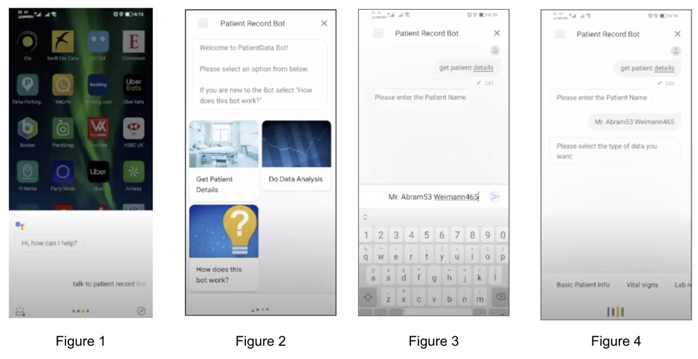
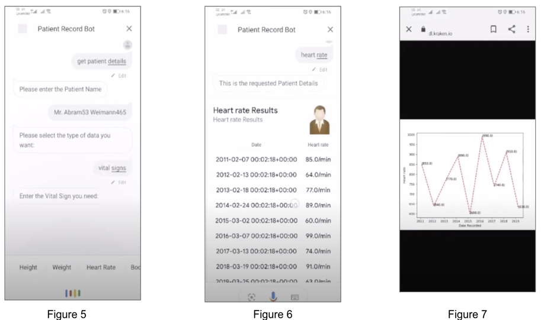
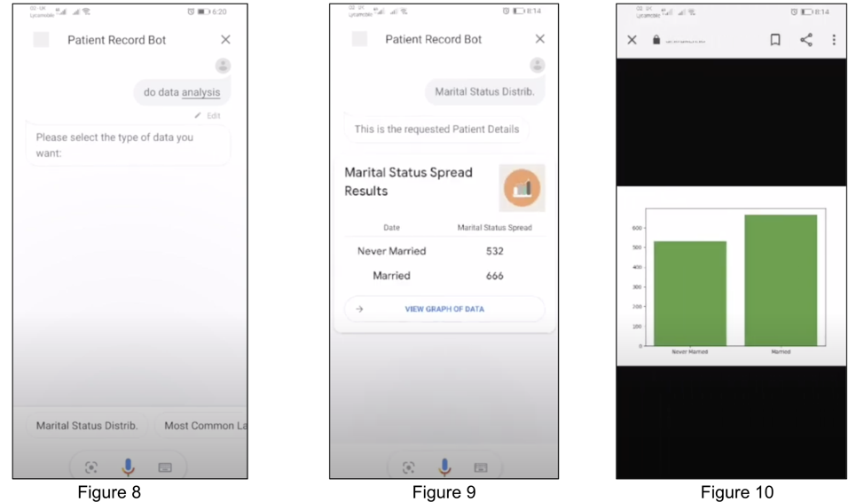
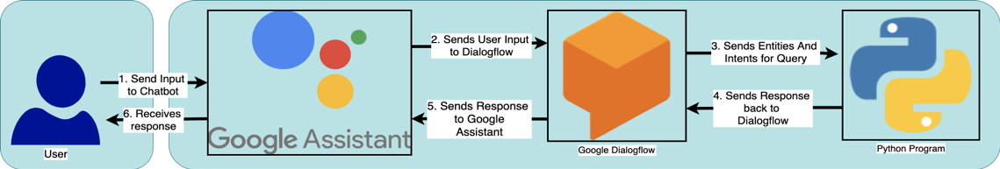

# Medical Chatbot for Patient Data Retrieval

## Quick Links
**Youtube video of project demo:** [https://www.youtube.com/watch?v=VaH56ElhJNI](https://www.youtube.com/watch?v=VaH56ElhJNI)
**Link to Microsoft Article publishing results for the Hackathon this project was entered in**: https://techcommunity.microsoft.com/t5/educator-developer-blog/hospital-innovation-with-computer-science-students-on-azure-fhir/ba-p/1451268

## Directory Structure
```
CODE
| - cardsList.py --> this is python file contains the JSON representation of the cards presented by the chatbot 
| - FHIRFunctions.py --> this python file contains the functions that allow me to access the patient data
| - DialogflowAgent --> this folder contains a representation of the DialogflowAgent used by the chatbot
| - CurrentPatientDetails.py and testingFlaskAndDialogFlow.py --> this folder contains the code that sends data to and from the Google assistant chatbot
```
## Project Information

**Introduction**

In a busy work environment, it is essential that medical staff have a fast way to retrieve patient data. After talking to a GP at the UCL-GOSH FHIRworks hackathon I learnt that an efficient method of obtaining patient data would allow more time for helping patients.

To improve the data retrieval process, I decided to create a Google Assistant Chatbot that could be utilized to access patient records. The user can initiate a conversation with the Bot by entering &quot;Talk to patient bot record&quot; as shown in figure 1. After this the user is taken to the home screen as shown in figure 2 where he/she can retrieve patient details, carry out data analysis on the patient records or, if they are a new user, get to know how the bot works. If the user chooses to retrieve patient details, they start off by entering the patient name (figure 3) and then the medical parameters they wish to retrieve (figure 4 and 5). Once this is complete the staff member can view the patient results in a tabular format (figure 6) or graphical format (figure 7).





If the user chooses to do data analysis instead of getting patient details, the user starts off by selecting the data analysis he/she wishes to perform (figure 8). The user can then view the results in either a tabular format (figure 9) or graphical format (figure 10).



I chose to create the chatbot on the Google Assistant platform since Google assistant is an application available on most devices. Furthermore, in Google assistant we can utilize voice commands as well, which makes the data retrieval fast.

**Technical solution**

Now that we have observed how the bot operates, we can take a closer look at the technological solution utilized to implement the chatbot. The diagram below summarizes the technological solution utilized:



<p align="center"> <b>Figure 11 </b></p>

The process starts with the user entering an input into the Google Assistant chatbot. Google assistant then transfers this input to Google Dialogflow. The purpose of Google Dialogflow is to extract the Intents and Entities from the user input. This essentially involves interpreting the purpose of a user input (e.g. if user input is &quot;get Blood Pressure&quot; then we know that the purpose of this command is stating which medical parameter the user wants) and extracting keywords from the user input (e.g. if user input is &quot;get Blood Pressure&quot; the keywords extracted from this command will be Blood and Pressure). These Intents and Entities are then sent to the python program that utilises this information to retrieve the necessary patient data / calculate the necessary values and formulate an appropriate response to return. This response is then sent back to Google Dialogflow, which forwards this response to the Google Assistant chatbot. The User then receives this response and enters in a follow-up input if required.

Therefore, it can be observed that the key technologies utilized are Google Dialogflow and the Python program. The purpose of Google Dialogflow is to interpret the intent of the user input and extract the keywords from the users input. The Python program then utilizes this information to retrieve the necessary patient data / calculate the necessary values and formulate an appropriate response to send back.

**Key Learnings and next steps**

Overall this project has allowed me to gain a deeper understanding into how Google Dialogflow works. In addition to this I have also been able to improve my python skills while creating the python script. Perhaps in the future, I would like to add more patient parameters (e.g. ECG rate) that could be retrieved by a medical staff member. Furthermore, the next steps would also involve working with hospitals to integrate the technology into a clinical setup.


## Additional Information
This project was complete in the UCL-GOSH FHIRworks hackathon. My project was one of the top 25 submissions to be selected out of 116 submissions. It is now published officially with the Great Ormond Street Hospital.
